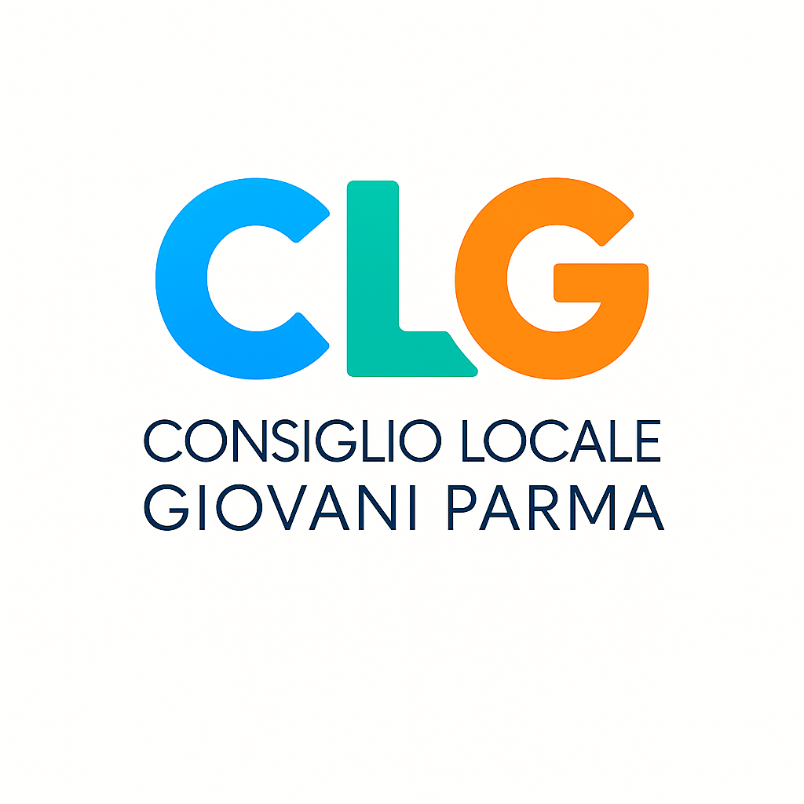

# 

## 1. THE HEART OF THE PROJECT
- **Title**: Parma European Youth Capital 2027
- **Vision**: "A Square for Europe. The Youth Taste of Transformation"
- **Main Goal**: To act as a spokeperson for the youth needs and issues, through the involvement and active partecipation of young people in the province of parma

## 2. THE ARCHITECTURE: HOW IT WORKS
- **2 Dimensions**:
  - **European**: "The 4 Paths of Transformation" (the strategic themes)
  - **Local**: "The 8 Squares" (the concrete thematic areas)

- **The 4 Paths of Transformation** (They connect everything):
  1.  Youth Participation
  2.  Culture and Policies for Sustainability
  3.  Well-being and Quality of Life
  4.  Conviviality of Differences

- **The 8 Squares** (Where action takes place):
  - Contemporary Agora / Regeneration and Living
  - Workshops of the Future / Food
  - Beauty / Inclusive Sport
  - Climate Disarmament / Open Education

## 3. THE PATH: ROAD TO 2027
- **2025**: Building youth-led governance
- **2026**: Engaging the community and schools; preparatory activities
- **2027**: The year of events, ceremonies, and impact

## 4. EXPECTED RESULTS (THE IMPACT)
- Concrete policies for the city
- Greater youth involvement in decision-making
- Parma as a model for youth policies